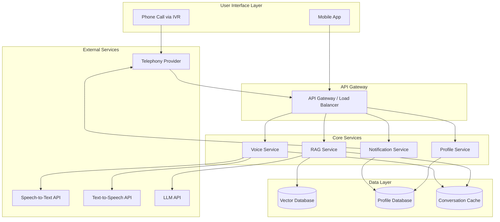

# Design Document: KisanVaani Agricultural Voice Assistant

## Overview

KisanVaani is a voice-first agricultural assistant that enables farmers to access government subsidies, crop guidance, and loan information through natural voice interactions. The system architecture follows a microservices pattern with three core services: Voice Service (handles STT/TTS), RAG Service (retrieves and generates responses), and Notification Service (proactive alerts). The design prioritizes simplicity, accessibility, and reliability for farmers with limited technical literacy operating in rural areas with variable network connectivity.

The system supports two interaction modes:
1. **Phone-based access**: Farmers call a toll-free number and interact via IVR
2. **Mobile app access**: Lightweight app with voice-first interface

## Architecture

### High-Level Architecture



### Technology Stack

**Voice Processing:**
- Speech-to-Text: Google Cloud Speech-to-Text API (supports Hindi and other Indian languages)
- Text-to-Speech: Google Cloud Text-to-Speech API (natural voices for regional languages)
- Alternative: Azure Speech Services for redundancy

**RAG Pipeline:**
- Embedding Model: `multilingual-e5-large` or `paraphrase-multilingual-mpnet-base-v2`
- Vector Database: Qdrant (open-source, self-hosted for cost efficiency)
- LLM: OpenAI GPT-4 or Anthropic Claude for response generation
- Document Processing: LangChain for chunking and embedding pipeline

**Telephony:**
- Primary: Exotel (India-specific, better local connectivity)
- Alternative: Twilio for IVR and voice call management
- WebRTC for mobile app voice

**Backend:**
- Language: Python (FastAPI for services)
- Message Queue: Redis for conversation cache, RabbitMQ for notification queue
- Database: PostgreSQL for farmer profiles and metadata

**Infrastructure:**
- Containerization: Docker
- Orchestration: Kubernetes (for scaling) or Docker Compose (for MVP)
- Cloud: AWS or Google Cloud Platform
- CDN: CloudFront for mobile app assets

## Components and Interfaces

### 1. Voice Service

**Responsibility:** Handles all voice input/output processing, including speech-to-text conversion, text-to-speech synthesis, and conversation state management.

**Interfaces:**

```python
class VoiceService:
    def process_speech_input(
        self,
        audio_stream: AudioStream,
        language_code: str,
        session_id: str
    ) -> SpeechToTextResult:
        """
        Convert speech audio to text.
        
        Args:
            audio_stream: Raw audio data from phone or app
            language_code: Language identifier (e.g., 'hi-IN', 'ta-IN')
            session_id: Unique session identifier for context
            
        Returns:
            SpeechToTextResult containing transcribed text and confidence score
        """
        pass
    
    def synthesize_speech(
        self,
        text: str,
        language_code: str,
        voice_profile: str = "default"
    ) -> AudioStream:
        """
        Convert text response to speech audio.
        
        Args:
            text: Response text to convert
            language_code: Target language for synthesis
            voice_profile: Voice characteristics (male/female, regional accent)
            
        Returns:
            AudioStream containing synthesized speech
        """
        pass
    
    def handle_unclear_speech(
        self,
        session_id: str,
        confidence_score: float
    ) -> str:
        """
        Generate prompt when speech is unclear.
        
        Args:
            session_id: Session identifier
            confidence_score: STT confidence (0.0 to 1.0)
            
        Returns:
            Prompt text asking farmer to repeat
        """
        pass
```

**Key Design Decisions:**
- Use streaming STT for faster response (process audio as it arrives)
- Cache common prompts in TTS to reduce API calls
- Set confidence threshold at 0.7 - below this, ask farmer to repeat
- Support audio formats: WAV, MP3, Opus (for mobile)

### 2. RAG Service

**Responsibility:** Implements the Retrieval-Augmented Generation pipeline to retrieve relevant documents from the knowledge base and generate contextual responses.

**Interfaces:**

```python
class RAGService:
    def process_query(
        self,
        query_text: str,
        farmer_profile: FarmerProfile,
        conversation_history: List[Message],
        language_code: str
    ) -> RAGResponse:
        """
        Process farmer query through RAG pipeline.
        
        Args:
            query_text: Transcribed farmer question
            farmer_profile: Farmer location, crop type for personalization
            conversation_history: Last 3-5 turns for context
            language_code: Language for response generation
            
        Returns:
            RAGResponse with answer text and source documents
        """
        pass
    
    def retrieve_documents(
        self,
        query_embedding: List[float],
        top_k: int = 5,
        filters: Dict[str, Any] = None
    ) -> List[Document]:
        """
        Retrieve relevant documents from vector database.
        
        Args:
            query_embedding: Vector representation of query
            top_k: Number of documents to retrieve
            filters: Metadata filters (e.g., document type, region)
            
        Returns:
            List of relevant documents with similarity scores
        """
        pass
    
    def generate_response(
        self,
        query: str,
        retrieved_docs: List[Document],
        conversation_context: str,
        language_code: str
    ) -> str:
        """
        Generate response using LLM with retrieved context.
        
        Args:
            query: Original farmer question
            retrieved_docs: Documents from vector DB
            conversation_context: Recent conversation for coherence
            language_code: Target language
            
        Returns:
            Generated response text grounded in retrieved documents
        """
        pass
    
    def handle_no_results(
        self,
        query: str,
        language_code: str
    ) -> str:
        """
        Generate fallback response when no relevant documents found.
        
        Args:
            query: Original query
            language_code: Target language
            
        Returns:
            Helpful message suggesting alternatives or human support
        """
        pass
```

**Key Design Decisions:**
- Chunk documents into 512-token segments with 50-token overlap
- Use hybrid search: vector similarity + keyword matching for better recall
- Implement re-ranking: retrieve top 10, re-rank to top 3 for LLM context
- Prompt engineering: Instruct LLM to only use provided documents, admit when unsure
- Response length: Target 2-3 sentences for voice delivery (30-45 seconds)

### 3. Query Handler

**Responsibility:** Coordinates query processing, manages conversation context, and handles multi-turn interactions.

**Interfaces:**

```python
class QueryHandler:
    def handle_query(
        self,
        session_id: str,
        query_text: str,
        farmer_id: str
    ) -> QueryResponse:
        """
        Coordinate end-to-end query processing.
        
        Args:
            session_id: Conversation session identifier
            query_text: Transcribed query from Voice Service
            farmer_id: Farmer identifier for profile lookup
            
        Returns:
            QueryResponse with answer and conversation state
        """
        pass
    
    def maintain_context(
        self,
        session_id: str,
        new_message: Message
    ) -> ConversationContext:
        """
        Update conversation context with new message.
        
        Args:
            session_id: Session identifier
            new_message: Latest user or system message
            
        Returns:
            Updated conversation context (last 3-5 turns)
        """
        pass
    
    def detect_clarification_needed(
        self,
        query: str,
        conversation_history: List[Message]
    ) -> Optional[str]:
        """
        Determine if query is ambiguous and needs clarification.
        
        Args:
            query: Current query text
            conversation_history: Recent conversation
            
        Returns:
            Clarification question if needed, None otherwise
        """
        pass
    
    def resolve_references(
        self,
        query: str,
        conversation_history: List[Message]
    ) -> str:
        """
        Resolve pronouns and references to previous conversation.
        
        Args:
            query: Query potentially containing references
            conversation_history: Recent conversation
            
        Returns:
            Query with references resolved to explicit entities
        """
        pass
```

**Key Design Decisions:**
- Store conversation context in Redis with 30-minute TTL
- Maintain 3-5 turn window (balance context vs. confusion)
- Use simple heuristics for reference resolution: "that scheme" → last mentioned scheme name
- Clarification triggers: ambiguous pronouns, multiple possible interpretations

### 4. Notification Service

**Responsibility:** Manages proactive outbound calls to farmers for alerts about new schemes and deadlines.

**Interfaces:**

```python
class NotificationService:
    def create_notification(
        self,
        notification_type: str,
        content: str,
        target_criteria: Dict[str, Any]
    ) -> Notification:
        """
        Create new notification for eligible farmers.
        
        Args:
            notification_type: Type of alert (new_scheme, deadline, etc.)
            content: Notification message content
            target_criteria: Filters for eligible farmers (location, crops)
            
        Returns:
            Notification object with delivery queue
        """
        pass
    
    def identify_eligible_farmers(
        self,
        criteria: Dict[str, Any]
    ) -> List[FarmerProfile]:
        """
        Find farmers matching notification criteria.
        
        Args:
            criteria: Filters (e.g., location='Punjab', crop='wheat')
            
        Returns:
            List of farmer profiles to notify
        """
        pass
    
    def schedule_outbound_call(
        self,
        farmer_id: str,
        notification_id: str,
        preferred_time: Optional[datetime] = None
    ) -> CallSchedule:
        """
        Schedule outbound voice call to farmer.
        
        Args:
            farmer_id: Target farmer identifier
            notification_id: Notification to deliver
            preferred_time: Optional preferred call time
            
        Returns:
            CallSchedule with scheduled time and retry logic
        """
        pass
    
    def handle_call_outcome(
        self,
        call_id: str,
        outcome: str,
        farmer_response: Optional[str] = None
    ) -> None:
        """
        Process result of outbound call attempt.
        
        Args:
            call_id: Call identifier
            outcome: Result (answered, no_answer, busy, failed)
            farmer_response: Optional farmer feedback during call
        """
        pass
```

**Key Design Decisions:**
- Use message queue (RabbitMQ) for async notification processing
- Batch notifications: process up to 100 calls per batch
- Retry logic: 1 retry if no answer, wait 4 hours between attempts
- Call timing: avoid early morning (before 8 AM) and late evening (after 8 PM)
- Rate limiting: max 50 concurrent outbound calls to avoid telephony overload

### 5. Profile Service

**Responsibility:** Manages farmer profiles including phone number, location, crop types, and preferences.

**Interfaces:**

```python
class ProfileService:
    def get_profile(
        self,
        farmer_id: str
    ) -> FarmerProfile:
        """
        Retrieve farmer profile by ID.
        
        Args:
            farmer_id: Unique farmer identifier (phone number)
            
        Returns:
            FarmerProfile with location, crops, preferences
        """
        pass
    
    def create_or_update_profile(
        self,
        phone_number: str,
        location: str,
        crop_types: List[str],
        language_preference: str
    ) -> FarmerProfile:
        """
        Create new profile or update existing one.
        
        Args:
            phone_number: Farmer's phone (unique identifier)
            location: District or village name
            crop_types: List of crops farmer grows
            language_preference: Preferred language code
            
        Returns:
            Created or updated FarmerProfile
        """
        pass
    
    def identify_by_phone(
        self,
        phone_number: str
    ) -> Optional[FarmerProfile]:
        """
        Look up farmer by phone number.
        
        Args:
            phone_number: Incoming call phone number
            
        Returns:
            FarmerProfile if exists, None for new farmer
        """
        pass
```

**Key Design Decisions:**
- Use phone number as primary identifier (no separate username/password)
- Store minimal data: phone, location (district level), 1-3 crop types, language
- No PII beyond phone number for MVP
- Profile creation: interactive voice flow on first call

### 6. Knowledge Base Manager

**Responsibility:** Handles document ingestion, processing, and embedding for the vector database.

**Interfaces:**

```python
class KnowledgeBaseManager:
    def ingest_document(
        self,
        document: Document,
        metadata: Dict[str, Any]
    ) -> IngestionResult:
        """
        Process and store new document in knowledge base.
        
        Args:
            document: PDF or text document to ingest
            metadata: Document metadata (source, date, category)
            
        Returns:
            IngestionResult with document ID and chunk count
        """
        pass
    
    def chunk_document(
        self,
        document_text: str,
        chunk_size: int = 512,
        overlap: int = 50
    ) -> List[TextChunk]:
        """
        Split document into overlapping chunks.
        
        Args:
            document_text: Full document text
            chunk_size: Target tokens per chunk
            overlap: Overlapping tokens between chunks
            
        Returns:
            List of text chunks with metadata
        """
        pass
    
    def generate_embeddings(
        self,
        text_chunks: List[TextChunk]
    ) -> List[Embedding]:
        """
        Generate vector embeddings for text chunks.
        
        Args:
            text_chunks: List of text chunks to embed
            
        Returns:
            List of vector embeddings
        """
        pass
    
    def update_document(
        self,
        document_id: str,
        new_document: Document
    ) -> IngestionResult:
        """
        Replace existing document with updated version.
        
        Args:
            document_id: ID of document to replace
            new_document: New document content
            
        Returns:
            IngestionResult with updated document ID
        """
        pass
```

**Key Design Decisions:**
- Support PDF and text document formats
- Extract text using PyPDF2 or pdfplumber
- Chunk size: 512 tokens (balance context vs. precision)
- Metadata: document type (scheme, crop_guide, loan_info), region, date, source
- Batch embedding: process 32 chunks at a time for efficiency

## Data Models

### FarmerProfile

```python
@dataclass
class FarmerProfile:
    farmer_id: str  # Phone number
    phone_number: str
    location: str  # District or village
    crop_types: List[str]  # e.g., ['wheat', 'rice']
    language_preference: str  # e.g., 'hi-IN', 'ta-IN'
    created_at: datetime
    last_interaction: datetime
```

### Message

```python
@dataclass
class Message:
    role: str  # 'user' or 'assistant'
    content: str
    timestamp: datetime
    language_code: str
```

### ConversationContext

```python
@dataclass
class ConversationContext:
    session_id: str
    farmer_id: str
    messages: List[Message]  # Last 3-5 turns
    created_at: datetime
    last_updated: datetime
    ttl_seconds: int = 1800  # 30 minutes
```

### Document

```python
@dataclass
class Document:
    document_id: str
    title: str
    content: str
    document_type: str  # 'scheme', 'crop_guide', 'loan_info'
    region: Optional[str]  # Applicable region/state
    source: str  # Source URL or organization
    published_date: datetime
    metadata: Dict[str, Any]
```

### TextChunk

```python
@dataclass
class TextChunk:
    chunk_id: str
    document_id: str
    text: str
    chunk_index: int
    embedding: Optional[List[float]]
    metadata: Dict[str, Any]
```

### RAGResponse

```python
@dataclass
class RAGResponse:
    answer_text: str
    source_documents: List[Document]
    confidence_score: float
    language_code: str
```

### Notification

```python
@dataclass
class Notification:
    notification_id: str
    notification_type: str  # 'new_scheme', 'deadline_reminder'
    content: str
    target_criteria: Dict[str, Any]
    created_at: datetime
    status: str  # 'pending', 'in_progress', 'completed'
```

### CallSchedule

```python
@dataclass
class CallSchedule:
    call_id: str
    farmer_id: str
    notification_id: str
    scheduled_time: datetime
    attempt_count: int
    max_attempts: int = 2  # Initial + 1 retry
    status: str  # 'scheduled', 'in_progress', 'completed', 'failed'
```


## Correctness Properties

A property is a characteristic or behavior that should hold true across all valid executions of a system—essentially, a formal statement about what the system should do. Properties serve as the bridge between human-readable specifications and machine-verifiable correctness guarantees.

### Property 1: Speech-to-Text Conversion Completeness

*For any* valid audio input from a farmer, the Voice_Interface should successfully convert the speech to text and return a transcription result.

**Validates: Requirements 1.1**

### Property 2: Low-Confidence Speech Prompting

*For any* speech input with confidence score below 0.7, the Voice_Interface should generate a prompt asking the farmer to repeat their query.

**Validates: Requirements 1.2**

### Property 3: Response Grounding in Retrieved Documents

*For any* farmer query that returns documents from the Knowledge_Base, the generated response text should only contain information present in the retrieved documents (no hallucination).

**Validates: Requirements 2.2, 2.3**

### Property 4: Text-to-Speech Conversion Completeness

*For any* generated response text, the Voice_Interface should successfully convert it to speech audio in the specified language.

**Validates: Requirements 3.1**

### Property 5: Response Repetition Capability

*For any* conversation session, when a farmer requests repetition, the system should replay the last response without modification.

**Validates: Requirements 3.3**

### Property 6: Notification Targeting Accuracy

*For any* new scheme added to the Knowledge_Base with targeting criteria (location, crop type), the Notification_Service should identify exactly the farmers whose profiles match all specified criteria.

**Validates: Requirements 4.1**

### Property 7: Notification Call Initiation

*For any* list of eligible farmers for a notification, the Notification_Service should schedule outbound calls for all farmers in the list.

**Validates: Requirements 4.2**

### Property 8: Notification Retry Logic

*For any* outbound call that results in "no answer" status, the system should schedule exactly one retry attempt.

**Validates: Requirements 4.3**

### Property 9: Document Embedding Generation

*For any* document uploaded to the Knowledge_Base, the system should process it into text chunks and generate embeddings for all chunks.

**Validates: Requirements 5.2**

### Property 10: Document Update Replacement

*For any* existing document in the Knowledge_Base, when an administrator uploads an updated version with the same document_id, the old version should be replaced and the new version should be retrievable.

**Validates: Requirements 5.3**

### Property 11: Farmer Profile Lookup

*For any* phone number used to access the system, the Profile_Service should either retrieve an existing Farmer_Profile or create a new one, ensuring every interaction has an associated profile.

**Validates: Requirements 6.1, 6.2**

### Property 12: Conversation Context Maintenance

*For any* conversation session, the Query_Handler should maintain the last 3-5 message turns in the conversation context and make them available for subsequent queries.

**Validates: Requirements 7.1**

### Property 13: Ambiguity Clarification

*For any* query that contains ambiguous references without sufficient context (e.g., "that scheme" with no prior scheme mentioned), the Query_Handler should generate a clarifying question before attempting retrieval.

**Validates: Requirements 7.2**

### Property 14: Voice Prompt Provision

*For any* interaction step in the voice interface (initial greeting, waiting for input, processing, etc.), the system should provide a voice prompt to guide the farmer.

**Validates: Requirements 8.1**

### Property 15: Error Fallback Messaging

*For any* system error or exception during query processing, the system should catch the error and provide a fallback message to the farmer with alternative contact information.

**Validates: Requirements 9.3**

### Property 16: Operation Logging

*For any* core operation (query processing, document ingestion, notification sending), the system should create a log entry with timestamp, operation type, and outcome.

**Validates: Requirements 9.2**

## Error Handling

### Voice Processing Errors

**STT Failures:**
- Timeout: If STT API doesn't respond within 10 seconds, return error and ask farmer to try again
- Low confidence: If confidence < 0.7, prompt farmer to repeat
- Unsupported language: If language detection fails, default to Hindi and inform farmer
- Audio quality issues: If audio is corrupted, ask farmer to check connection and retry

**TTS Failures:**
- API unavailable: Fall back to pre-recorded messages for common responses
- Synthesis timeout: Return text response via SMS as backup (if mobile number available)

### RAG Pipeline Errors

**Retrieval Failures:**
- Vector DB unavailable: Return cached popular queries/responses
- No documents found: Provide helpful message: "I don't have information about that. Please call our helpline at [number]"
- Embedding generation fails: Log error, retry once, then fail gracefully

**Generation Failures:**
- LLM API timeout: Use template-based response with retrieved document titles
- LLM returns empty response: Fall back to document excerpts
- Response too long: Truncate to 3 sentences and offer to provide more details

### Telephony Errors

**Call Failures:**
- Number unreachable: Mark for retry, update farmer profile status
- Call dropped mid-conversation: Store conversation state, resume if farmer calls back within 5 minutes
- IVR system overload: Queue calls and provide estimated wait time

### Data Errors

**Profile Errors:**
- Invalid phone number: Validate format, reject if invalid
- Missing required fields: Prompt farmer to provide during first interaction
- Profile lookup fails: Create temporary session, prompt for registration

**Document Ingestion Errors:**
- PDF parsing fails: Log error, notify admin, skip document
- Embedding generation fails: Retry with smaller chunks
- Duplicate document: Check hash, skip if identical, update if different

### Network and Infrastructure Errors

**Timeout Handling:**
- Set timeouts: STT (10s), TTS (5s), Vector DB (3s), LLM (15s)
- Implement exponential backoff for retries
- After 3 failed retries, fail gracefully with user message

**Rate Limiting:**
- Implement rate limits: 10 requests/minute per farmer
- For notification calls: 50 concurrent calls max
- Queue excess requests, process when capacity available

## Testing Strategy

### Overview

KisanVaani requires a dual testing approach combining unit tests for specific scenarios and property-based tests for universal correctness guarantees. Unit tests validate concrete examples, edge cases, and integration points, while property-based tests verify that system behaviors hold across all possible inputs through randomized testing.

### Property-Based Testing

**Framework:** Use `hypothesis` (Python) for property-based testing with minimum 100 iterations per test.

**Test Configuration:**
```python
from hypothesis import given, settings
import hypothesis.strategies as st

@settings(max_examples=100)
@given(audio_input=st.binary(min_size=1000, max_size=50000))
def test_property_1_speech_to_text_conversion(audio_input):
    """
    Feature: agricultural-voice-assistant
    Property 1: Speech-to-Text Conversion Completeness
    
    For any valid audio input, Voice_Interface should return transcription.
    """
    result = voice_service.process_speech_input(audio_input, "hi-IN", "test-session")
    assert result is not None
    assert isinstance(result.text, str)
```

**Property Test Coverage:**

1. **Property 1 (STT Conversion):** Generate random audio samples, verify transcription returned
2. **Property 2 (Low Confidence Prompting):** Generate inputs with varying confidence, verify prompts when < 0.7
3. **Property 3 (Response Grounding):** Generate random queries and documents, verify response content exists in documents
4. **Property 4 (TTS Conversion):** Generate random text, verify audio output produced
5. **Property 5 (Repetition):** Generate random conversations, verify last response repeatable
6. **Property 6 (Notification Targeting):** Generate random schemes and profiles, verify matching logic
7. **Property 7 (Call Initiation):** Generate random farmer lists, verify all scheduled
8. **Property 8 (Retry Logic):** Generate random call outcomes, verify retry count
9. **Property 9 (Embedding Generation):** Generate random documents, verify embeddings created
10. **Property 10 (Document Update):** Generate random documents, verify replacement
11. **Property 11 (Profile Lookup):** Generate random phone numbers, verify profile exists after call
12. **Property 12 (Context Maintenance):** Generate random conversations, verify context window size
13. **Property 13 (Clarification):** Generate ambiguous queries, verify clarification requested
14. **Property 14 (Prompt Provision):** Generate random interaction states, verify prompts exist
15. **Property 15 (Error Fallback):** Generate random errors, verify fallback messages
16. **Property 16 (Logging):** Generate random operations, verify log entries created

### Unit Testing

**Framework:** Use `pytest` for unit tests.

**Unit Test Focus Areas:**

**Voice Service:**
- Test specific language support (Hindi, Tamil)
- Test audio format handling (WAV, MP3, Opus)
- Test confidence threshold edge cases (exactly 0.7, 0.69, 0.71)
- Test prompt templates for different scenarios

**RAG Service:**
- Test document chunking with various sizes
- Test hybrid search (vector + keyword)
- Test re-ranking logic
- Test response length constraints (2-3 sentences)
- Test no-results scenario with specific query
- Test multilingual query handling

**Query Handler:**
- Test context window management (exactly 3, 5 turns)
- Test reference resolution ("that scheme", "the loan")
- Test clarification detection for specific ambiguous phrases
- Test session timeout (30 minutes)

**Notification Service:**
- Test eligibility matching with specific criteria
- Test retry scheduling (4-hour gap)
- Test call timing restrictions (8 AM - 8 PM)
- Test batch processing (100 calls per batch)

**Profile Service:**
- Test phone number validation formats
- Test profile creation flow
- Test profile update scenarios
- Test missing field handling

**Knowledge Base Manager:**
- Test PDF parsing with sample documents
- Test chunk overlap calculation
- Test metadata extraction
- Test document versioning

### Integration Testing

**End-to-End Flows:**
1. Phone call → STT → RAG → TTS → Response delivery
2. Mobile app query → Profile lookup → RAG → Response
3. Document upload → Processing → Embedding → Retrieval
4. Scheme addition → Farmer matching → Notification call

**External Service Mocking:**
- Mock Google Cloud STT/TTS APIs for consistent testing
- Mock LLM API with deterministic responses
- Mock Exotel/Twilio for telephony testing
- Use test vector database instance

### Performance Testing

**Load Testing:**
- Simulate 1,000 concurrent calls
- Measure response times: STT (< 5s), RAG (< 3s), TTS (< 2s)
- Test notification batch processing (100 calls)

**Stress Testing:**
- Test system behavior at 1,500 concurrent calls (150% capacity)
- Test vector DB with 100,000 document chunks
- Test conversation cache with 10,000 active sessions

### Test Data

**Synthetic Data Generation:**
- Generate sample government scheme documents (PDFs)
- Create test farmer profiles (1,000 profiles with varied locations/crops)
- Record sample audio in Hindi and Tamil for STT testing
- Create conversation transcripts for context testing

**Test Knowledge Base:**
- 50 sample scheme documents
- 30 crop guidance documents
- 20 loan information documents
- Metadata: regions (Punjab, Tamil Nadu, Karnataka), dates, categories

### Continuous Testing

**CI/CD Integration:**
- Run unit tests on every commit
- Run property tests on pull requests
- Run integration tests nightly
- Run performance tests weekly

**Test Coverage Goals:**
- Unit test coverage: > 80%
- Property test coverage: All 16 properties
- Integration test coverage: All critical paths
- Error handling coverage: All error scenarios

### Manual Testing

**User Acceptance Testing:**
- Test with sample farmers (5-10 users)
- Test in Hindi and one regional language
- Test on actual phones (not just simulators)
- Gather feedback on voice clarity and response quality

**Accessibility Testing:**
- Test with users of varying literacy levels
- Test in noisy environments (farm settings)
- Test with poor network conditions (2G/3G)
- Test with different phone models and audio quality

## Notes

- The design prioritizes simplicity and reliability over advanced features for MVP
- Voice-first approach ensures accessibility for farmers with limited literacy
- RAG pipeline ensures responses are grounded in verified documents, reducing hallucination risk
- Microservices architecture allows independent scaling of voice, RAG, and notification services
- Conversation context (3-5 turns) balances coherence with simplicity
- Single retry for notifications balances persistence with avoiding annoyance
- Phone number as identifier eliminates authentication friction for farmers
- Error handling focuses on graceful degradation and clear user communication
